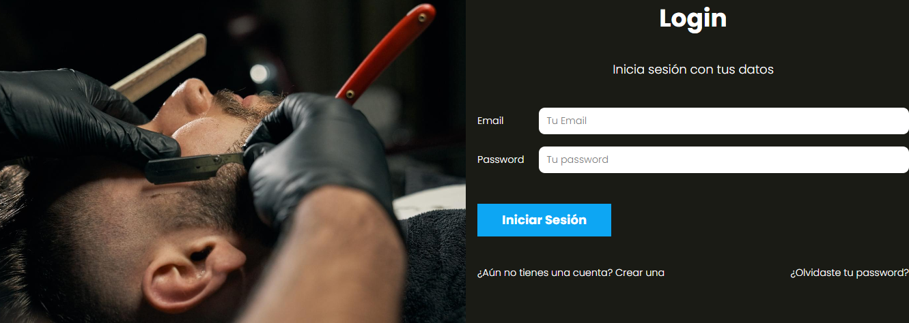
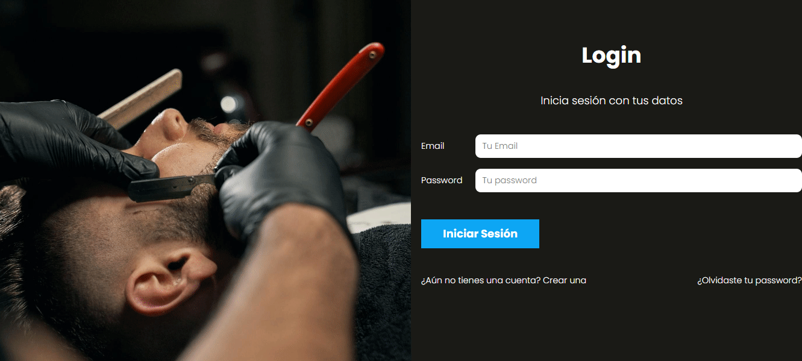

<h1 align="center">Welcome to AppSalon :sparkles:</h1>

This project is one of the first that I built with the MVC structure, it simulates a web application for a beauty salon, it has the simple functions of an application of this type such as user registration, a login as in other applications and, in case of forgetting the password to be able to recover it. All users will be able to book the date they want the service, you can choose several services and at the end you will be presented with a summary of the service you are requesting.

The application also has an area for the administrator where all appointments made by all users are shown as well as the possibility of deleting these appointments, among other functionalities. 

The project was built with the MVC structure, mostly with PHP language, JavaScript was also used for small functionalities and also to build an API to query the database through Fetch API. The MySQL database consists of different tables to store data such as: the registration of those who will use the web app (mail, personal information), services, appointments made.

## Registration views :house:

It is the part that every user sees when entering the application, here you can perform different actions, for example, if you have an account you can log in, if you have an account and do not remember the password you can recover it through the mail and in case you do not have an account you can create one to enter the application.

all these actions have their own form and due validations. As I mentioned, there is the possibility to recover a password or verify the account when creating a new account, for this I used PHPMailer to test the correct operation of these actions.

## Admin view :feet:

In this view the administrator will be able to see the appointments made by the users, where the type of service, the date, the client's name and cell phone number are shown, as well as having the option to delete the reservation. The administrator can create more services and can update the ones he already has to change some data as well as delete any of these. There is the option to verify by date that appointments or services should be performed, using the JavaScript functionalities that data is taken and through the GET method proceeds to query the database to filter that information by date.

## Customer view	:mag_right:

This is the way in which customers or user can book their appointment, the view presents the user with the different services offered in the barbershop with their respective prices, followed by this, you are asked the day and time you want the services, finally the summary is shown to check the data and thus confirm or modify those that were not clear, for the confirmation alert I used <a href="https://sweetalert2.github.io/" target="_blank">SweetAlert</a> and thus give a better user experience.

All the information requested is required to make the appointment so everything is duly validated, in case of missing any mandatory data, the application will notify the user that his registration cannot be completed, once all the information is completed, the appointment will be booked in the database.

## Responsive :balloon:

It is worth mentioning that the project is fully responsive for phones 480px, tablets 768px, computers 1024px.

## Author :black_nib:
This project is part of the course "Desarrollo web Completo" whose the instructor is Juan de la Torre, you can see his page <a href="https://codigoconjuan.com/" target="_blank">here</a>:arrow_forward:.

:octocat: **Randy Urriola**
- Portfolio: <a href="https://randy-urriola.github.io/Portfolio/" target="_blank">/randy-urriola</a>
- GitHub: <a href="https://github.com/randy-urriola" target="_blank">@randy-urriola</a>
- LinkedIn: <a href="https://www.linkedin.com/in/randy-urriola/" target="_blank">@randy-urriola</a>

## 💻 Programming Lenguages and Tools used:

<code></code>&nbsp;&nbsp;
<code></code>&nbsp;&nbsp;
<code></code>&nbsp;&nbsp;
<code></code>&nbsp;&nbsp;
<code></code>&nbsp;&nbsp;
<code></code>&nbsp;&nbsp;
<code></code>&nbsp;&nbsp;
<code></code>&nbsp;&nbsp;
